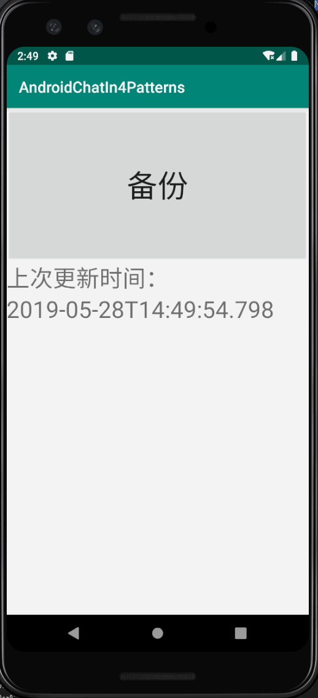
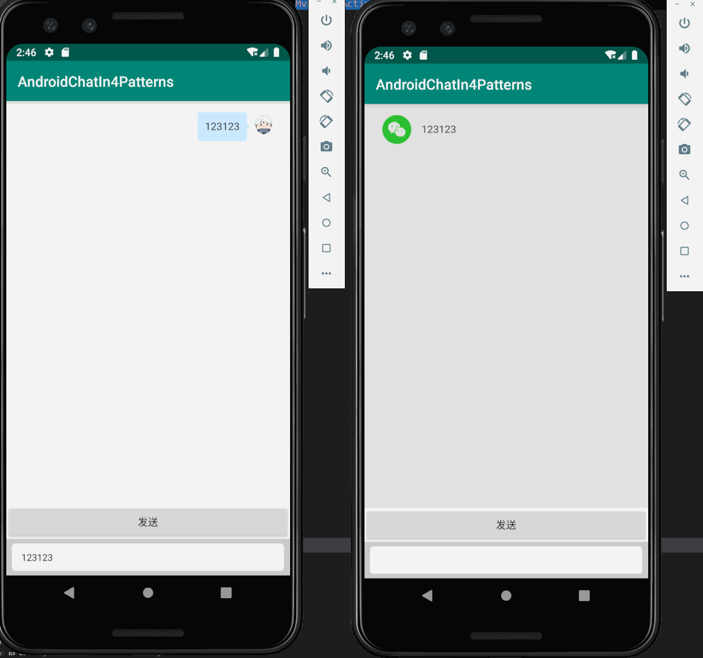
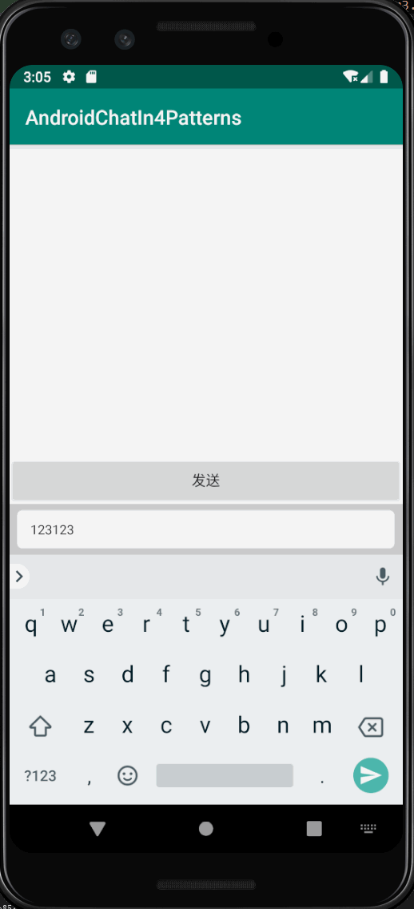

# 使用MVC、MVP、MVVM和FRP实现Android局域网群聊应用

| 姓名      | 学号   |
| --------- | ------ |
| 161250010 | 陈俊达 |
| 161250002 | 蔡蔚霖 |
| 161250060 | 李培林 |
| 161250199 | 张凌哲 |

# 1. 简介

在本报告中，我们使用MVC、MVP、MVVM和FRP分别实现了一个Android局域网群聊应用，并通过分析在使用这四个架构实现应用功能的过程中每个架构所表现出的特点，来分析每个架构自身的优点和缺点。

# 2. 项目说明

项目地址：https://github.com/viccrubs/android-chat-in-4-patterns

项目可直接使用Android Studio打开，需注意Android Studio应安装有lombok插件（[安装教程](https://projectlombok.org/setup/android#android-studio)）。本项目分为3个模块 ：app, server, shared。三个模块的说明如下表：
 
| 模块     | 作用                       | 启动方式                                      |
| -------- | -------------------------- | --------------------------------------------- |
| `app`    | Android应用部分            | 使用模拟器或者实机打开                        |
| `server` | 聊天服务器端               | 直接运行`nju.androidchat.server.ChatServer`类 |
| `shared` | 包含有服务端和客户端公用类 | 不启动                                        |

## 2.1 应用需求

为了展示各个架构在实现功能的过程中的特点，我们将需求分成**基础需求**和**扩展需求**。

### 2.1.1 基本需求

服务器

1.	建立与多个客户端的连接
2.	接受任何一个已连接的客户端发送的消息，并发送到其他所有客户端

客户端

1.	发起到服务器的连接
2.	接受用户输入文字信息
3.	发送文字信息到服务器
4.	接受服务器文字信息并显示

### 2.1.2 扩展需求

| 功能编号 | 实现的功能点简介       | 功能详细介绍                                                                                                                             | 使用架构 | 使用本架构的代码实现                                                                                                                              | 相对于上一个架构的优点                                         | 使用此架构实现本需求点的不足之处                                                                                                                                         | 更好的架构 | 更好的实现                                                                                                                                                                                                            |
| -------- | ---------------------- | ---------------------------------------------------------------------------------------------------------------------------------------- | -------- | ------------------------------------------------------------------------------------------------------------------------------------------------- | -------------------------------------------------------------- | ------------------------------------------------------------------------------------------------------------------------------------------------------------------------ | ---------- | --------------------------------------------------------------------------------------------------------------------------------------------------------------------------------------------------------------------- |
| 1        | 增加消息记录云备份功能 | 增加一个界面，界面中有一个按钮，点击按钮后将本地的消息记录发送到某个云服务器                                                             | MVC      | 增加一个Activity，Activity连接一个Controller。当用户点击备份按钮后，Activity将备份请求转发给C，C转发给M，M发起网络请求，且在结束后通知V修改界面。 |                                                                | 当按下按钮后View无法及时响应（M还在等待响应，没有通知V数据变化）                                                                                                         | MVP        | P能够控制V（对比C不能控制V），所以当V（Activity）将备份请求给P时，P可以控制V进行及时的、恰当的显示（比如显示备份中字样）                                                                                              |
| 2        | 撤回消息               | 某个客户端的用户选择一条消息撤回（只能是自己发的消息），其他用户的客户端上，如果该消息存在于浏览页面，这一消息会被置换为“该消息已被撤回” | MVP      | 在P和V中都增加处理逻辑，P中当接受到撤回消息的请求时，调用V的撤回消息方法；V的响应方法中，将对应消息文本框的text设置成“已撤回”                     |                                                                | 需要同时修改P和V。当业务逻辑复杂时（例如说一个消息可能具有很多状态（撤回也可以考虑成一个消息的状态）每个状态都需要在UI上进行特殊显示时），P和V可能需要增加很多处理函数。 | MVVM       | 将消息状态和界面进行双向绑定，修改消息ViewModel的状态就会同时更改界面中对象消息的状态，不需要单独的逻辑处理。同时也可以把界面上的输入框和某个属性进行双向绑定，减少UI事件处理的代码。（这个其实可以算一个单独的功能） |
| 3        | 过滤脏话               | 当客户端接受到信息时，根据预设的脏话列表（表现为正则表达式数组）匹配信息内容，如果匹配到信息里包含脏话，则信息修改为***                  | MVVM     | 修改在VM和UI组件的绑定处理函数中（就是，当VM改变时UI应该怎么改变），增加判断逻辑。若包含脏话，则将显示的信息设置为***                             |                                                                | 需要修改逻辑。若逻辑更加复杂，则可能使此绑定函数过于冗长，难以维护。                                                                                                     | FRP        | 将接受到的信息看作一个流，增加判断逻辑只是在这个流上增加过滤函数而已；增加逻辑也只需要增加过滤函数而不是修改已有逻辑                                                                                                  |
| 4        | 限制用户发送消息频率   | 限制用户在1s中只能发出一条信息，消息发送后1s内不允许发送。                                                                               | FRP      | 将用户发送信息也考虑为一个流，使用throttle对发送消息函数进行节流                                                                                  | 只需要增加流处理函数，不需要修改已有逻辑，也不需要手动写计时器 |                                                                                                                                                                          |            |                                                                                                                                                                                                                       |

## 2.2 实现说明

1. 使用Java语言
2. 所有客户端和服务器运行在同一台机器，使用Socket通信

在实际实现中，我们将采用以下形式：
1. 首先使用MVC，MVP，MVVM和FRP四种架构分别实现基础需求
    - 初始设计中考虑所有功能点的前置条件
        1. 功能1：客户端本地已经保存消息记录
        2. 功能2：需要项目配好junit，MVP中P对M和V应该是依赖接口，而不是依赖具体类
        1. 功能3：需要区分不同的请求类型；每个接受到的信息可以独立修改
        1. 功能4：倒是没有特殊的前置条件
        1. 功能5：倒是没有特殊的前置条件。
        1. 作业1：每个接受的的信息用单独的容器显示，而不是在一个TextBox里修改其文本（和功能3比较类似）
        1. 作业2：同上
        1. 作业3：这个让他们自己改吧
2.	复制1次MVC的原始代码（称为MVP-0），在复制的MVC代码中实现功能1
    1. 实现了功能1的MVC代码编号为代码MVC-1
3.	复制2次MVP的原始代码（MVP-0），在第一份MVP代码中实现功能1，第二份实现功能2
    1. 实现了功能1的MVP代码编号为代码MVP-1，和MVC-1形成对照
    1. 实现了功能2的MVP代码编号为代码MVP-2
4.	复制2次MVVM的原始代码（MVVM-0），在第一份代码中实现功能2，在第二份代码中实现功能3
    1. 实现功能2的MVVM代码编号为代码MVVM-2，和MVP-2形成对照
    1. 实现功能3的MVVM代码编号为代码MVVM-3
5.	复制2次FRP的原始代码（FRP-0），在第一份代码中实现功能3，第二份代码中实现功能4
    1. 实现了功能4的FRP代码编号为FRP-3，和MVVM-3对照
    1. 实现了功能5的FRP代码编号为FRP-4

## 2.3 应用使用

系统使用配置文件确定**在登录后要进入哪个Activity**（称为**目标Activity**）。

要修改登录后进入哪个窗口，修改`app/assets/config.properties`文件中`chat_activity`为对应的类名。可选的类名有如下格式：
> `nju.androidchat.client.{架构: Mvc|Mvp|Mvvm|Frp}{编号: 1|2|3|4}.{架构: Mvc|Mvp|Mvvm|Frp}{编号: 1|2|3|4}TalkActivity`
 
例如：要进入之上提到的**实现了功能3的MVVM代码**，应将其修改为

> `nju.androidchat.client.mvvm3.Mvvm3TalkActivity`

要启动应用，设置好**目标Activity**后，应首先启动Server。等Server启动完成后（显示下图的字样即启动完成），再使用Android Studio运行多个客户端。

当客户端启动成功后，输入用户名后点击登录按钮进行登录。要注意多个客户端不能使用同一个用户名，否则登录时将会报错。

进入主界面后，输入信息点击发送即可将信息发送出去。本机发出的信息显示在右边，其他用户发送的信息显示在左边。

通过修改**目标Activity**，可以尝试各个功能的效果。

功能1：

功能2：

功能3：

# 3. 